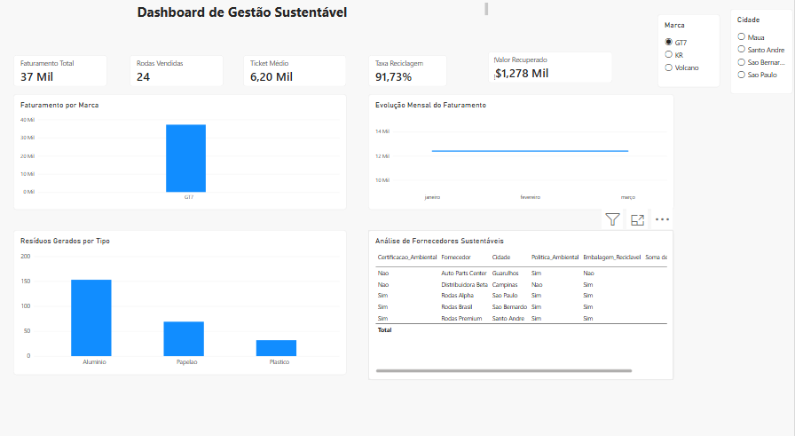

# ♻️ Dashboard de Gestão Sustentável — Loja de Rodas

## 📌 Sobre o projeto

Este projeto foi desenvolvido com o objetivo de analisar dados comerciais e ambientais de uma loja de rodas automotivas.

A solução utiliza Python, SQL e Power BI para transformar dados de vendas, resíduos e fornecedores em indicadores que auxiliam na tomada de decisão e na adoção de práticas mais sustentáveis.

## 🎯 Objetivos

- Analisar o faturamento da loja.
- Identificar as marcas com maior participação nas vendas.
- Acompanhar a evolução mensal do faturamento.
- Monitorar a quantidade de resíduos gerados.
- Calcular a taxa de reciclagem e reutilização.
- Avaliar o valor recuperado com materiais recicláveis.
- Identificar fornecedores com práticas ambientais mais sustentáveis.

## 🛠️ Tecnologias utilizadas

- Python
- Pandas
- Matplotlib
- PostgreSQL
- SQL
- Power BI
- Git
- GitHub
## 📊 Principais indicadores

O dashboard apresenta indicadores como:

- Faturamento total
- Quantidade de rodas vendidas
- Ticket médio
- Taxa de reciclagem
- Valor recuperado com resíduos
- Faturamento por marca
- Evolução mensal do faturamento
- Resíduos gerados por tipo
- Indicadores ambientais dos fornecedores

## 🌱 Sustentabilidade

Além da análise comercial, o projeto acompanha o impacto ambiental da operação.

Os dados permitem analisar a destinação de resíduos como alumínio, papelão e plástico, identificar materiais reciclados ou reutilizados e avaliar fornecedores com base em critérios ambientais.

A análise pode auxiliar a empresa na redução de descartes inadequados, aumento da reciclagem e escolha de fornecedores mais sustentáveis.
## 📈 Dashboard Power BI

## 📁 Estrutura do projeto

03-projeto-loja-rodas-sustentavel/
├── dados/
├── imagens/
├── powerbi/
├── python/
├── sql/
└── README.md

## 👨‍💻 Autor

João Abner