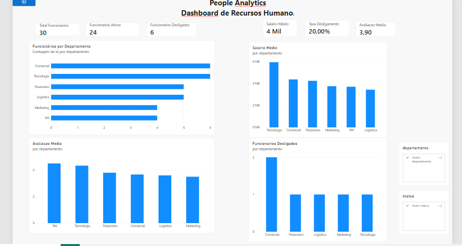

# 📊 People Analytics — Análise de Recursos Humanos

## 📌 Sobre o projeto

Este projeto apresenta uma análise de dados de Recursos Humanos utilizando Python, PostgreSQL, SQL e Power BI.

O objetivo é transformar dados de funcionários em indicadores que auxiliem na análise da força de trabalho, remuneração, desempenho e desligamentos.

O projeto faz parte do meu portfólio de Análise de Dados.

---

## 🎯 Objetivos

A análise busca responder perguntas como:

- Quantos funcionários estão ativos?
- Quantos funcionários foram desligados?
- Qual é o salário médio da empresa?
- Qual é a avaliação média de desempenho?
- Como os funcionários estão distribuídos entre os departamentos?
- Quais departamentos possuem maior salário médio?
- Quais departamentos apresentam maior proporção de desligamentos?
- Como o desempenho médio varia entre funcionários ativos e desligados?

---

## 🛠️ Tecnologias utilizadas

- Python
- Pandas
- Matplotlib
- PostgreSQL
- SQL
- Power BI
- DAX
- Git
- GitHub

---

## 📂 Estrutura do projeto

```text
04-people-analytics/
│
├── dados/
│   └── funcionarios.csv
│
├── python/
│   └── analise_rh.py
│
├── sql/
│   ├── 01_criacao_tabela.sql
│   ├── 02_inserts.sql
│   └── 03_consultas.sql
│
├── powerbi/
│   └── dashboard_people_analytics.pbix
│
├── imagens/
│   ├── funcionarios_departamento.png
│   ├── salario_departamento.png
│   ├── taxa_desligamento_departamento.png
│   └── dashboard_people_analytics.png
│
└── README.md
```

---

## 🐍 Análise com Python

A etapa inicial foi desenvolvida com Pandas para leitura, tratamento e análise dos dados.

Foram analisados indicadores como:

- funcionários ativos e desligados;
- salário médio;
- avaliação média de desempenho;
- funcionários por departamento;
- salário médio por departamento;
- desligamentos por departamento;
- taxa de desligamento;
- tempo médio de empresa;
- desempenho por status.

O Matplotlib foi utilizado para gerar visualizações dos principais indicadores.

---

## 🗄️ PostgreSQL e SQL

Os dados também foram armazenados em um banco PostgreSQL.

Foram desenvolvidas consultas SQL utilizando recursos como:

- `SELECT`
- `WHERE`
- `COUNT`
- `AVG`
- `GROUP BY`
- `ORDER BY`
- `FILTER`
- cálculos percentuais

As consultas permitem analisar headcount, salários, desempenho e desligamentos por departamento.

---

## 📊 Dashboard Power BI

O Power BI foi conectado ao banco PostgreSQL para construção de um dashboard interativo de People Analytics.

### Principais indicadores

- Total de funcionários: **30**
- Funcionários ativos: **24**
- Funcionários desligados: **6**
- Taxa de desligamento: **20%**
- Salário médio: aproximadamente **R$ 4,33 mil**
- Avaliação média de desempenho: **3,90**

O dashboard também permite analisar os indicadores por departamento e status por meio de segmentações de dados.

---

## 🖥️ Dashboard



---

## 📈 Análises realizadas

O dashboard apresenta:

- funcionários por departamento;
- salário médio por departamento;
- desligamentos por departamento;
- avaliação média por departamento;
- filtros por departamento;
- filtros por status.

A análise permite identificar diferenças entre áreas da empresa e explorar possíveis padrões relacionados a remuneração, desempenho e desligamentos.

> A base utilizada neste projeto é uma base de estudo. As análises são exploratórias e não representam evidência de relação causal entre desempenho, salário e desligamento.

---

## 🔄 Fluxo do projeto

```text
CSV
 ↓
Python / Pandas
 ↓
PostgreSQL
 ↓
SQL
 ↓
Power BI
 ↓
Dashboard
```

---

## 🎓 Aprendizados

Com este projeto pratiquei:

- manipulação de dados com Pandas;
- criação de indicadores de RH;
- agrupamentos e filtros;
- criação de gráficos com Matplotlib;
- modelagem e armazenamento de dados no PostgreSQL;
- consultas SQL;
- conexão entre PostgreSQL e Power BI;
- criação de medidas DAX;
- construção de dashboard interativo;
- interpretação de indicadores de People Analytics.

---

## 👤 Autor

**João Abner**

Projeto desenvolvido para fins de estudo e composição de portfólio profissional em Análise de Dados.